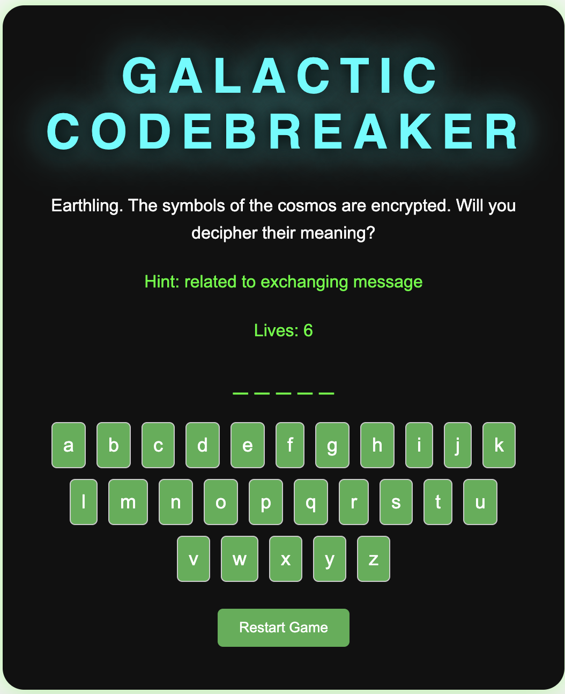

# Galactic Codebreaker - Word Guessing Game
## Screenshot

## Link 
- ** https://hemi112007.github.io/space-man/

## Game Overview
"Galactic Codebreaker" is a fun and challenging word guessing game where you try to guess a secret word by selecting individual letters. Players have six attempts (lives) to guess the word correctly before losing the game. Each word is associated with a hint to guide the player.

### How to Play:
1. The game will present a hint related to a secret word.
2. Try to guess the word by clicking on the available letters.
3. If you guess a correct letter, it will appear in the word. If you guess wrong, you lose a life.
4. The game continues until either you guess the word or lose all lives.

## Technologies Used
- **JavaScript**: For the game logic and interactivity.
- **HTML**: To structure the content.
- **CSS**: For styling the game.

## Next Steps

- **Add a timer for each round to make the game more challenging.
- **Implement different difficulty levels (e.g., easy, medium, hard) with longer or shorter words.
- **Store high scores or win/loss statistics.
- **Add multiplayer functionality for two players to play on the same computer.
- **Create a mobile-friendly version of the game.